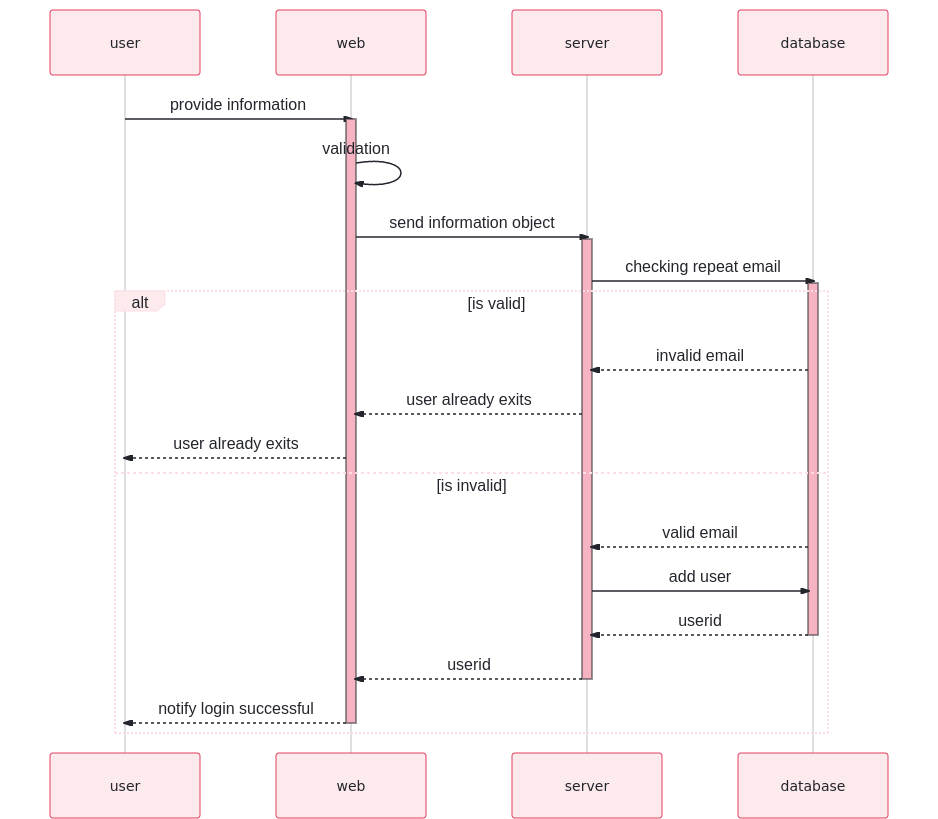
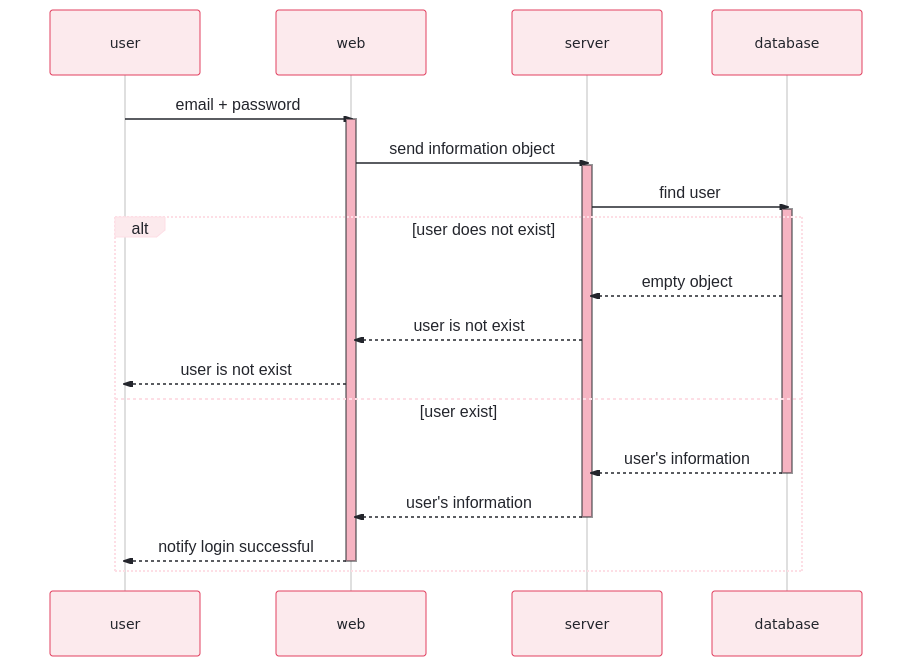
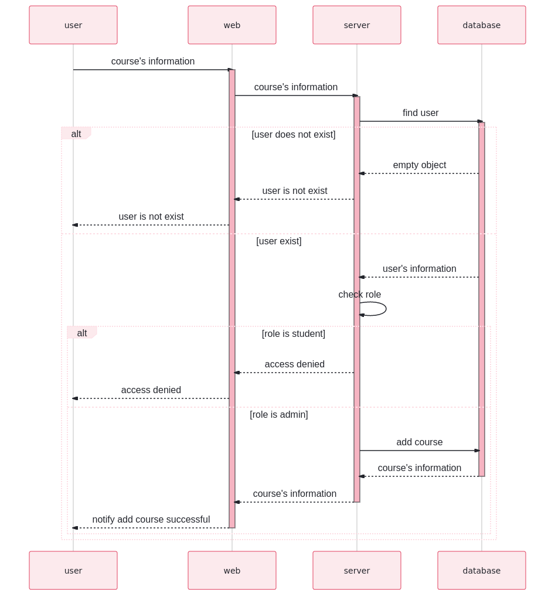
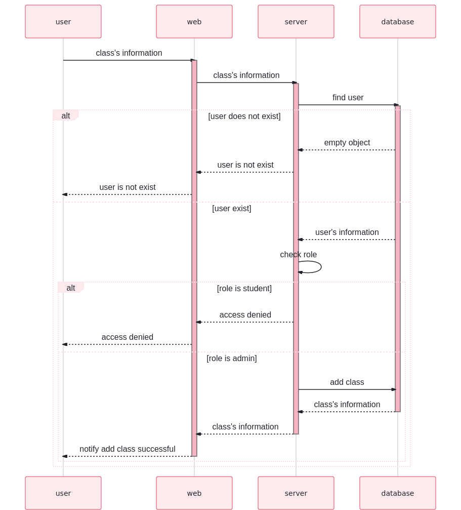

# management_courses
Create apis for an application which is built to manager courses, students and class.

## Table database design
The table is design with some constraint:
+ Course have multiple class
+ Class have multiple student
+ Student join only 1 class

## Sequence diagrams

### Register function

### Login function

### Add course function

### Add class function

